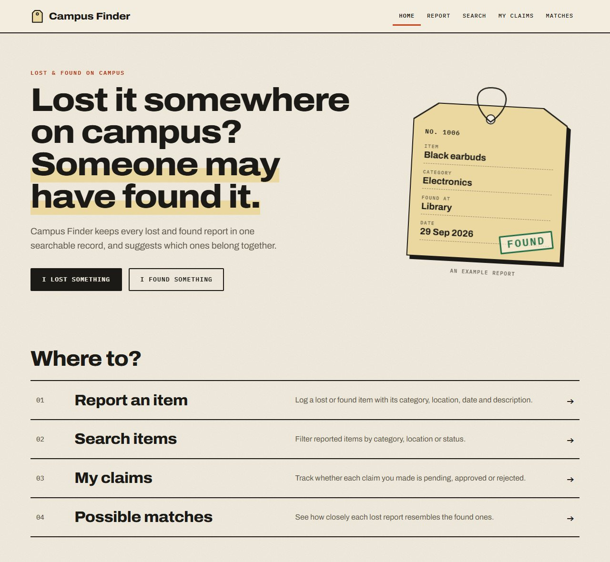
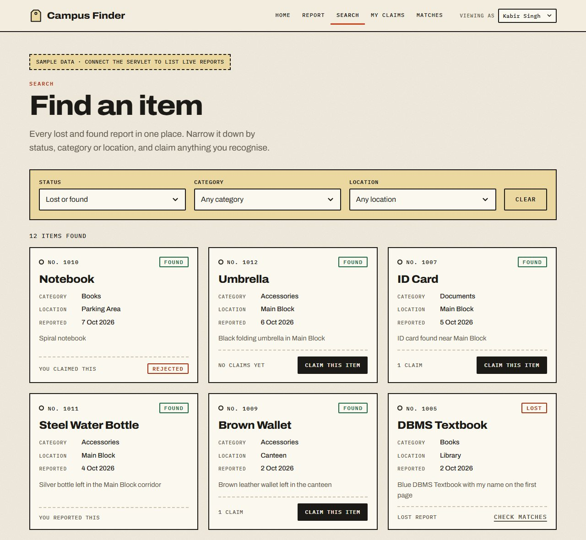
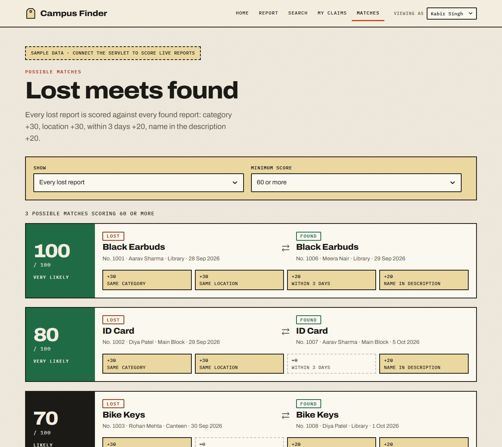

# Campus Finder

**A smart lost and found system for a campus.** Students report what they lost or found, search every report, claim what is theirs, and let the database suggest which lost and found reports belong together.

DBMS course project &middot; Oracle SQL &middot; HTML, CSS, JavaScript &middot; Java servlets (planned)



## What it does

| Screen | File | What you can do |
|---|---|---|
| Report | `report-item.html` | Log a lost or found item with its category, location, date and description |
| Search | `search.html` | Filter every report by status, category and location, and claim a found item |
| My Claims | `my-claims.html` | Track each claim as pending, approved or rejected |
| Matches | `matches.html` | See lost reports paired with the found reports that look most alike, scored out of 100 |



## How matching works

The project's novelty feature. Every lost report is compared with every found report, and four checks add up to a score out of 100. It is computed in a single SQL query (a self-join on `ITEM`) with no external AI.

| Check | Points |
|---|---|
| Same category | +30 |
| Same location | +30 |
| Reported within 3 days of each other | +20 |
| The lost description contains the found item's name (any case) | +20 |
| **Maximum** | **100** |

The same rule is written twice, so the web pages and the database agree: as SQL in [`docs/campus_finder_queries.sql`](docs/campus_finder_queries.sql) (queries Q3 and Q4) and as JavaScript in [`js/match.js`](js/match.js).



## Data model

Six tables. The ER diagram is linked in [`ER DIAGRAM.txt`](ER%20DIAGRAM.txt).

| Table | Kind | Primary key | Foreign keys |
|---|---|---|---|
| `STUDENT` | strong | `student_id` | |
| `CATEGORY` | strong | `category_id` | |
| `LOCATION` | strong | `location_id` | |
| `ITEM` | strong | `item_id` | `student_id`, `category_id`, `location_id` |
| `CLAIM` | weak (needs an item) | `item_id` + `student_id` | `item_id`, `student_id` |
| `ITEM_IMAGE` | weak (needs an item) | `item_id` + `image_no` | `item_id` |

## Project structure

```
home.html            landing page
report-item.html     report a lost or found item (posts to ReportItemServlet)
search.html          search and claim
my-claims.html       claim tracker
matches.html         possible matches
css/style.css        all styles
js/data.js           sample rows (same as the SQL sample data) and the mode switch
js/match.js          the match scoring rule
js/app.js            page behaviour
docs/
  campus_finder_queries.sql                 schema, sample data and queries Q1-Q10 for Oracle
  Campus_Finder_Important_Queries.pdf       the queries explained, with join counts
  screenshots/                              images used in this README
```

## Run it

### The web pages

No build step. Open `home.html` in Chrome or Edge, or serve the folder:

```
python -m http.server 8000
```

then visit `http://localhost:8000/home.html`.

By default the pages run in **demo mode**:

- Search, My Claims and Matches read the sample rows in `js/data.js`.
- Reports you submit and claims you make are saved in the browser only, so the whole flow works without a server: report, matches, search, claim, my claims.
- The *Viewing as* menu in the header stands in for logging in.
- *Reset sample data* in the footer clears everything you added.

To post the report form to a real servlet instead, set the mode in `js/data.js`:

```js
window.CF_MODE = 'live';
```

The form then submits `item_status`, `item_name`, `reported_date`, `category_id`, `location_id` and `description` to `ReportItemServlet`. The servlet is not in this repository yet.

### The database

Needs Oracle Database 12c or newer.

```
sqlplus <user>/<password>@<service> @docs/campus_finder_queries.sql
```

The script creates the six tables, loads a small sample data set with fixed dates (so match scores never change), and runs queries Q1 to Q10. Data types are assumptions, so adjust them if your own tables differ. If the tables already exist, run only the queries section.

## The queries

[`docs/Campus_Finder_Important_Queries.pdf`](docs/Campus_Finder_Important_Queries.pdf) explains each one with a join-by-join breakdown, sample output and likely questions.

| Query | What it does | Joins |
|---|---|---|
| Q1 | Report an item (`INSERT` with a sequence) | 0 |
| Q2 | Search items by category and status | 3 |
| Q3 | Possible match finder (self-join, from the project slides) | 1 |
| Q4 | Possible matches with names, best only | 6 |
| Q5 | My claims for one student | 3 |
| Q6 | Submit a claim, approve one, reject the rest (one transaction) | 0 |
| Q7 | Reports per category (`GROUP BY`, `HAVING`) | 1 |
| Q8a | Found items nobody has claimed (`LEFT JOIN`) | 2 |
| Q8b | The same, with `NOT EXISTS` | 1 |
| Q9 | Top 3 reporters | 1 |
| Q10 | Activity summary across all six tables | 5 |

## Tech stack

- **Database:** Oracle, queried with SQL*Plus
- **Front end:** HTML, CSS and JavaScript, no frameworks
- **Backend (planned):** Java servlets or Spring Boot over JDBC (`ojdbc11`), so the browser never talks to Oracle directly

## Status

Done: data model, the Oracle script and queries, all five pages, the match scoring.

Next:
- Java servlets and JDBC, so Search, My Claims and Matches read live data
- A staff screen to approve or reject claims (today this is query Q6)
- Login, so reports and claims carry the signed-in student
- Photo upload into `ITEM_IMAGE`
- Loading categories and locations from the database instead of the HTML

## Team

Simarjot Singh Anand and Pranjal Singh
